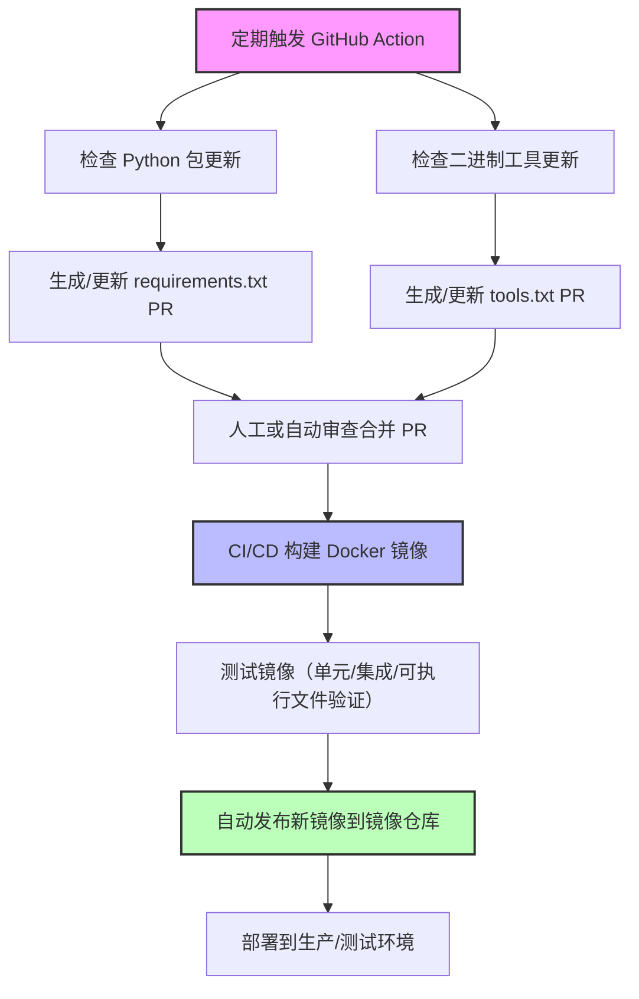

 # 依赖项初始化安装和更新说明文档

## **核心原则**

1. **不可变容器**

    * Docker 容器启动后不应该在内部频繁修改依赖/二进制。
    * 所有更新最好在 **构建阶段**完成，这样镜像可重现。

2. **自动化 + 可审查**

    * 依赖更新应该可追踪、可审查，不要直接在运行容器里拉取最新版。

3. **分层管理**

    * 可以把不同类型的依赖分开管理：Python 包、二进制工具、Go 项目本身。

---

## **方案设计**

### **1️⃣ 依赖声明文件**

* Python 包：`requirements.txt`（或 `pyproject.toml`）
* 二进制可执行文件：`tools.txt` 或类似配置文件，列出工具名称、版本、下载 URL 或 checksum

例如 `tools.txt`：

```
ffmpeg 6.0 https://ffmpeg.org/releases/ffmpeg-6.0.tar.gz
um 1.2 https://example.com/um-1.2.tar.gz
```

---

### **2️⃣ GitHub Actions / CI/CD 自动更新**

* **Python 包**：定期检查更新 → 生成 PR → 审查/合并 → 构建镜像
* **二进制工具**：

    1. 定期检查工具版本（官方 release API 或 hash 校验）
    2. 如果有更新 → 生成 PR 更新 `tools.txt`
    3. CI/CD 根据 `tools.txt` 下载对应版本并打包到镜像

这样可以做到：

* 更新可追踪（PR 有记录）
* 构建镜像可重现
* 避免在运行时拉取二进制文件

---

### **3️⃣ Dockerfile 示例**

```dockerfile
FROM golang:1.21

# 安装 Python
RUN apt-get update && apt-get install -y python3 python3-pip wget tar && rm -rf /var/lib/apt/lists/*

WORKDIR /app

# 拷贝依赖声明文件
COPY requirements.txt tools.txt ./

# 安装 Python 包
RUN pip install -r requirements.txt

# 安装二进制工具
RUN while read name version url; do \
        wget "$url" -O /tmp/$name.tar.gz && \
        tar -xzf /tmp/$name.tar.gz -C /usr/local/bin --strip-components=1; \
    done < tools.txt

# 拷贝 Go 代码
COPY . .

RUN go build -o myapp .

CMD ["./myapp"]
```

> 这样做的好处：Python + 二进制工具全部在 **镜像构建阶段安装**，启动后不修改镜像。

---

### **4️⃣ 自动化更新流程**

1. **定期 Action**：

    * Python 包：`pip list --outdated` 或 Dependabot
    * 二进制工具：通过 API 检查最新 release
2. **生成 PR**：

    * 更新 `requirements.txt` / `tools.txt`
3. **CI/CD 构建镜像**：

    * 测试通过后自动发布新镜像

---

### **5️⃣ 优点**

* 镜像 **可重现**、**可追踪**
* **单一源**管理依赖（文本文件）
* 支持多种类型依赖（Python + 二进制）
* 自动化更新，但可审查，安全性高

---

💡 **进阶优化**

* 对二进制文件可用 **checksum 校验**，确保下载正确
* 可以用 `Makefile` 或小脚本生成 `tools.txt` 版本列表
* Python 和二进制依赖都可以用 Dependabot / Renovate 类工具管理

---

## 流程概览

